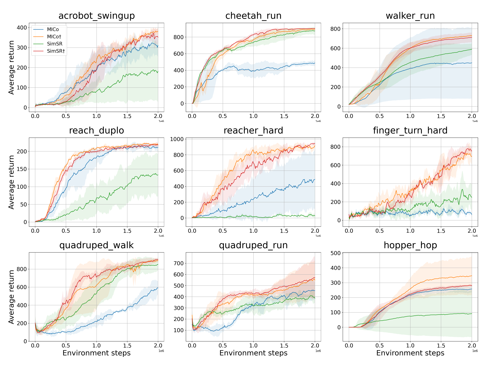

# Revisiting Bisimulation Metric for Robust Representation in Reinforcement Learning #



This is the code base for our paper on [Revisiting Bisimulation Metric for Robust Representation in Reinforcement Learning]. Our method introduces a new metric for measuring state-action pair similarity with adaptive coefficients, overcoming the limitations of traditional bisimulation metrics.

## Environment Setup
Our experimental setup is based on the [DrQ-v2](https://github.com/facebookresearch/drqv2) framework. For details on dependencies and environment configuration, please refer to the `environment.yml` file.

## Instructions
To train the model, use the following scripts:
```
# Run on a cluster
$ bash cluster_run.sh
# Run locally
$ bash run.sh
```
Ensure to update the scripts if needed to match your specific setup.

## Results
For empirical results and further details, refer to the paper. Our experiments demonstrate significant improvements in sampling efficiency and task performance.